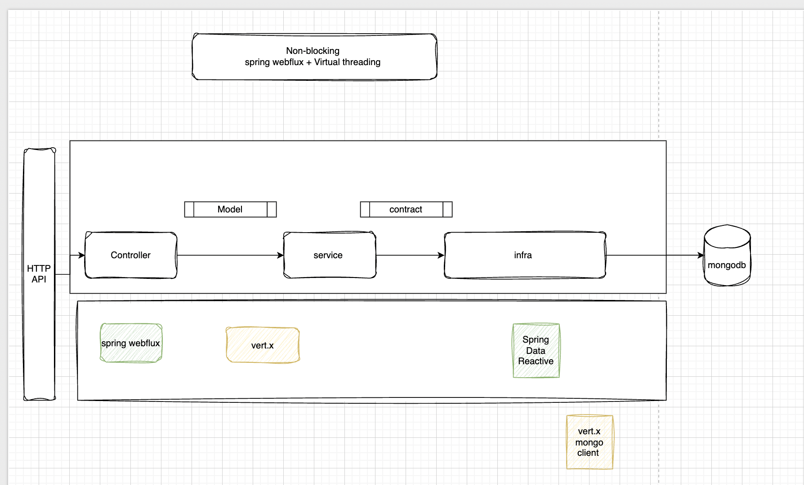
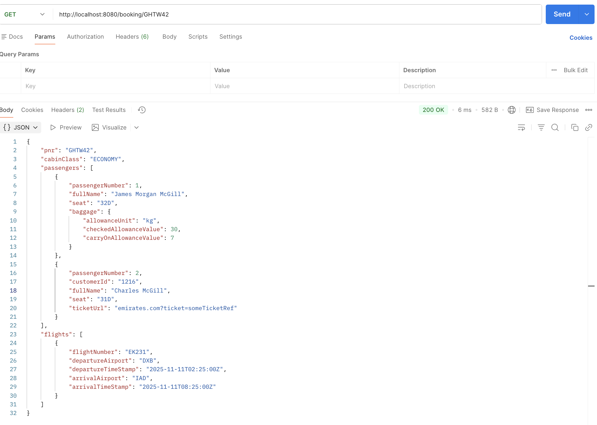
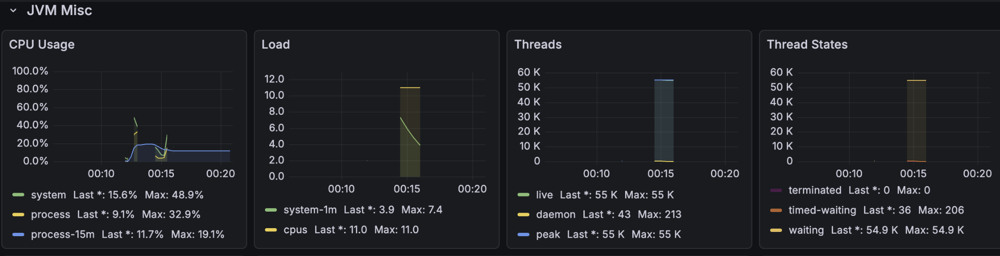
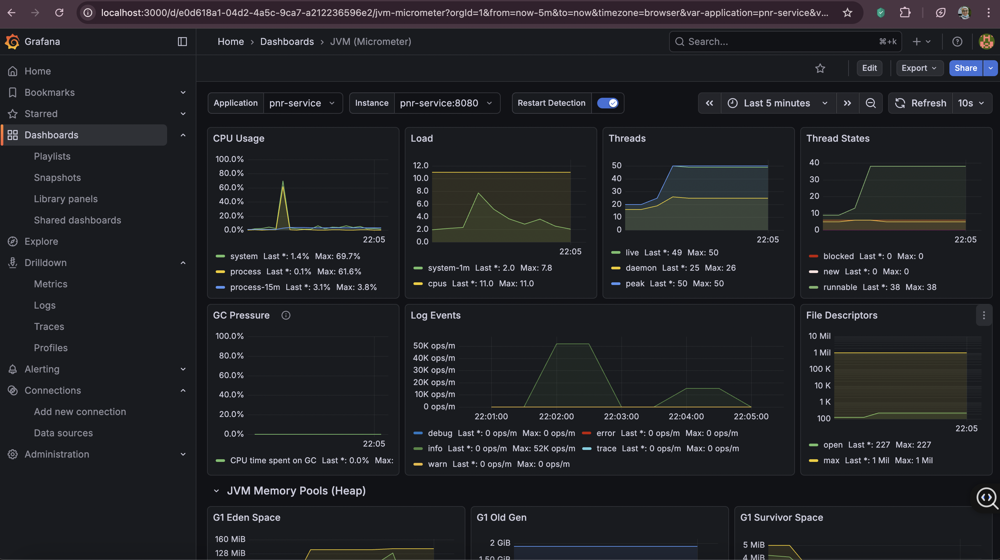
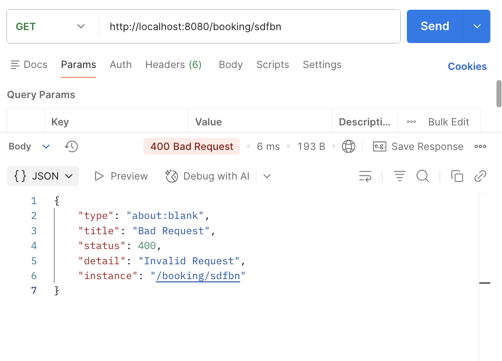
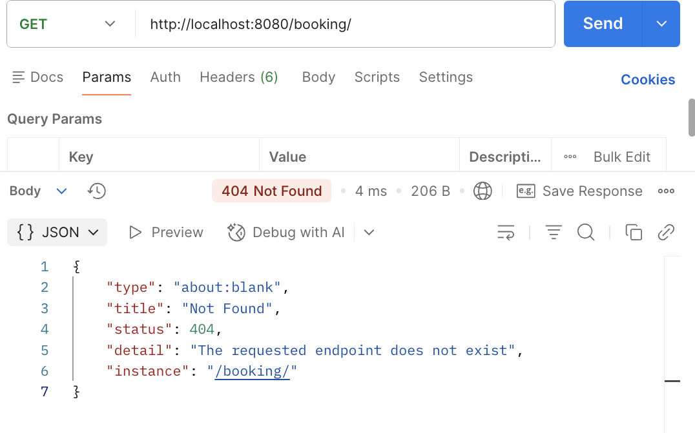
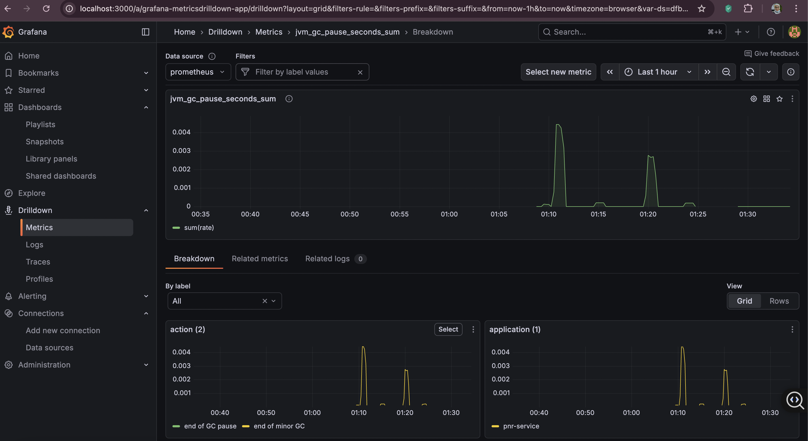

# DVT Task – PNR Information Aggregator

## Overview

This project implements a **reactive PNR (Passenger Name Record) information aggregator** for an airline booking system.

The service exposes a **RESTful API** that retrieves and aggregates booking information for a given PNR by combining data from multiple sources in a **non-blocking, event-driven** manner.

---
## Design Decisions Summary

- Spring Boot for REST and DI
- Vert.x for async orchestration
- MongoDB as source of truth
- Contract-first OpenAPI
- Explicit error mapping
- Zero blocking calls


### Primary Capability

Retrieve **fully aggregated booking information** for a given PNR in a **single API call**.

### Aggregated Data Includes

1. **Trip Information**
    - Cabin class
    - Flights (departure / arrival airports and timestamps)
    - Passengers (names, seats, optional customer IDs)

2. **Baggage Allowances**
    - Checked baggage allowance
    - Carry-on allowance
    - Per passenger

3. **ETicket Information**
    - Ticket URLs per passenger
    - Missing tickets handled gracefully

---

## Business Context
booking data is distributed across multiple data stores.

This service demonstrates how to:
- Aggregate data from **multiple async sources**
- Execute **parallel non-blocking calls**
- Preserve **event-loop safety**
- Handle **partial data availability**
- Return a **single coherent read model**

---

## Technology Stack

| Component        | Technology        | Version  | Purpose                      |
|------------------|-------------------|----------|------------------------------|
| Language         | Java              | 21 (LTS) | Modern language features     |
| Framework        | Spring Boot       | +3.5     | REST, DI, OpenAPI            |
| Reactive Engine  | Vert.x            | +4.5     | Non-blocking async execution |
| Database         | MongoDB           | –        | Source of truth              |
| API Spec         | OpenAPI           | 3.1      | Contract-first API           |
| Testing          | JUnit 5 + Mockito | Latest   | Unit & integration testing   |
| Coverage         | JaCoCo            | 0.8.12   | Coverage enforcement         |
| Containerization | Docker            | Latest   | Deployment readiness         |

---

## Architectural flow

### Clean Architecture ( Hexagonal Pattern - Read Model )

```
Controller → Application Service → Domain Repositories → Infrastructure
```

### Key Principles

- Controllers are thin
- Business orchestration lives in application services
- Domain models are immutable
- Infrastructure details are isolated
- Reactive flows use Vert.x Futures

---

## Core Flow

1. Client calls `GET /booking/{pnr}`
2. Controller delegates to application service
3. Service:
    - Fetches core booking
    - Extracts passenger IDs
    - Fetches baggage and tickets **in parallel**
4. Results are aggregated into a single booking model
5. Response is returned to the client

---

## Output result 
- 
- ### Blocking Thread (No vert.x )
- ### Non-Blocking using vert.x 
- 
- 
- 
- 
- - ### increasing GC performance using ZGC 

### Retrieve Booking by PNR

**Endpoint**
```
GET /booking/{pnr}
```
```bash
curl -X GET http://localhost:8080/booking/GHTW42
```
**Successful Response (200)**

```json
{
  "pnr": "GHTW42",
  "cabinClass": "ECONOMY",
  "passengers": [
    {
      "passengerNumber": 1,
      "fullName": "James Morgan McGill",
      "seat": "32D",
      "baggage": {
        "allowanceUnit": "kg",
        "checkedAllowanceValue": 30,
        "carryOnAllowanceValue": 7
      }
    },
    {
      "passengerNumber": 2,
      "customerId": "1216",
      "fullName": "Charles McGill",
      "seat": "31D",
      "ticketUrl": "emirates.com?ticket=someTicketRef"
    }
  ],
  "flights": [
    {
      "flightNumber": "EK231",
      "departureAirport": "DXB",
      "departureTimeStamp": "2025-11-11T02:25:00Z",
      "arrivalAirport": "IAD",
      "arrivalTimeStamp": "2025-11-11T08:25:00Z"
    }
  ]
}
```

---

## Error Handling

The service uses **Problem Details**.

| Status | Scenario                |
|--------|-------------------------|
| 400    | Invalid PNR format      |
| 404    | Booking not found       |
| 500    | Unexpected server error |


---

## Project Structure

```
src/main/java/com/airline/pnr
├── api
│   ├── PnrQueryController.java
│
├── application
│   └── BookingAggregatorQueryService.java
├── model
│   └── Booking.java
│   └── Flight.java
│   └── Passenger.java
│   └── BaggageAllownce.java
│
├── domain
│   ├── exception
│   └── valueobjects
│
├── infrastructure
│   ├── entities
│   └── repositories/access
│   ├── mappers
│   ├── repositorieImp

│
└── config
```

---

## Reactive Design Highlights

### Parallel Fan-Out

- Baggage and ticket retrieval run in parallel
- No blocking calls
- Event-loop safe execution

### Immutable Aggregation

- Domain models are Java records
- Enrichment returns new instances
- No shared mutable state

---

### Coverage

Coverage is enforced using **JaCoCo** with minimum thresholds:

- Instruction: 70%
- Line: 70%
- Branch: 50%


---

## Getting Started

### Prerequisites

- Java 21
- Maven 3.8+
- Docker (optional)

### Build & Test

```bash
mvn clean verify
```


## Getting Started

### Prerequisites

Ensure the following tools are installed locally:

- Java 21 (LTS)
- Maven 3.8+
- Docker & Docker Compose

### Run Using Docker Compose 

The project provides a `docker-compose.yml` that starts **all required services**:

- MongoDB (database)
- PNR Service (Spring webflux + Vert.x)
- Prometheus (metrics collection)
- Grafana (monitoring dashboard)

#### Available Services

| Service     | Port  | Purpose                  |
|-------------|-------|--------------------------|
| pnr-service | 8080  | PNR aggregation REST API |
| mongodb     | 27017 | MongoDB database         |
| prometheus  | 9090  | Metrics scraping         |
| grafana     | 3000  | Monitoring dashboards    |

---

### Build and Start All Services

```bash
docker compose up --build
```

This command will:
- Build the PNR service Docker image
- Start MongoDB
- Start Prometheus and Grafana
- Wait for MongoDB health check before starting the API

---

### Start the Service only 


### Start Only the PNR Service

```bash
docker compose up -d --build pnr-service
```

---

### Stop and Clean Environment

```bash
docker compose down --rmi all
```

This stops all containers and removes built images

### Build the Application

```bash
mvn clean package
```

---

### Run the Application

#### Option 1: Run via Spring Boot

```bash
mvn spring-boot:run
```

#### Option 2: Run the packaged JAR

```bash
java -jar target/airline-pnr-service.jar
```

The application will start on:

```
http://localhost:8080
```

---

### Run Tests

```bash
mvn test
```

---

### Run Tests with Coverage

```bash
mvn clean verify
```

Coverage report will be generated at:

```
target/site/jacoco/index.html
```

---

### Swagger UI

Once the application is running, access Swagger at:

```
http://localhost:8080/swagger-ui/index.html
```


## Final Notes

This project focuses on correctness, clarity, and reactive design principles while maintaining a prod